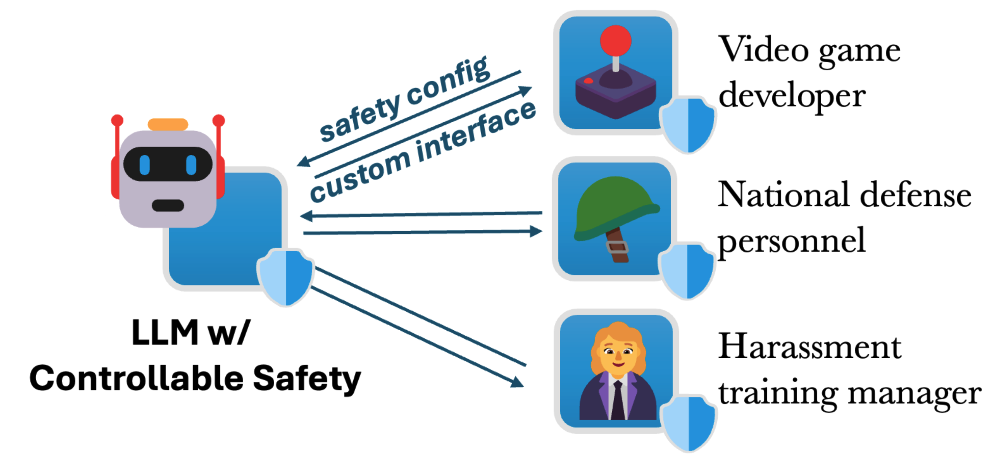
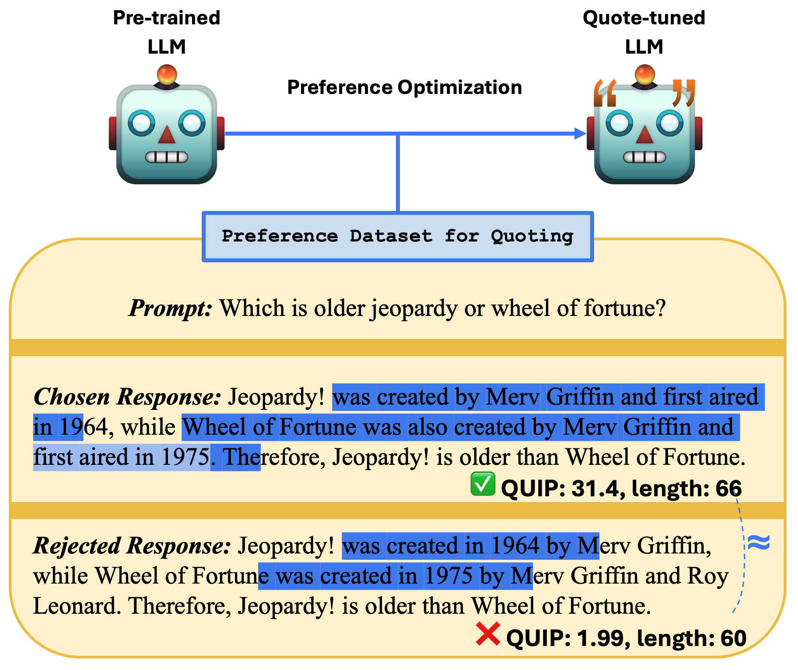
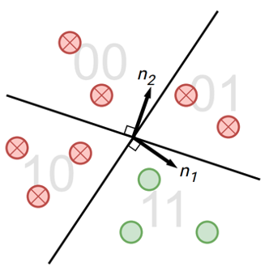

I am a CS PhD student at the [Center for Language and Speech Processing](https://www.clsp.jhu.edu/), [Johns Hopkins University](https://www.jhu.edu/), advised by [Daniel Khashabi](https://danielkhashabi.com/) and [Benjamin Van Durme](https://www.cs.jhu.edu/~vandurme/index.html). I'm also a part-time student researcher at Microsoft.

<!-- My research interest lies in the area of natural language processing. I am particularly interested in the responsible development and deployment of foundation models. Recently, I am focusing on safety alignment and enhancing attribution of LLMs. -->

My research interest lies in the area of natural language processing, particularly in the **safety**, **trustworthiness**, and **alignment** of foundation models. My recent work focuses on safety alignment and enhancing verifiability of LLMs.

In the past, I have collaborated with [Mark Dredze](https://www.cs.jhu.edu/~mdredze/) at JHU CLSP, [Yulia Tsvetkov](https://homes.cs.washington.edu/~yuliats/) and [Tianxing He](https://cloudygoose.github.io/) at the University of Washington, and [Jim Glass](http://people.csail.mit.edu/jrg/) at MIT CSAIL. I completed my B.S. also from JHU with majors in Computer Science, Mathematics, Applied Mathematics, and minor in Economics. GO HOP! 💙🤍

I'm always excited about collaborations. If you are interested in working together, please feel free to drop me an email: `jzhan237[at]jhu.edu`!

<!-- I can be reached at [jzhan237@jhu.edu](mailto:jzhan237@jhu.edu). -->

<!-- ## Publications -->
<!-- TODO: write some detailed descriptions of selected works -->
<!-- a good example: https://bencw99.github.io/ -->

<!-- one example https://yzpang.github.io/ -->

<!-- code for highlighting below -->
<!--  -->

## Selected Works

<!-- **Jingyu Zhang**, Ahmed Elgohary, Ahmed Magooda, Daniel Khashabi, Benjamin Van Durme. [Controllable Safety Alignment: Inference-Time Adaptation to Diverse Safety Requirements](https://arxiv.org/abs/2410.08968). *ICLR 2025*. -->

<!-- 

  

    
  

  

    <strong><a href="https://arxiv.org/abs/2410.08968">Controllable Safety Alignment: Inference-Time Adaptation to Diverse Safety Requirements</a></strong>
     <strong>Jingyu Zhang</strong>, Ahmed Elgohary, Ahmed Magooda, Daniel Khashabi, Benjamin Van Durme.
     <em>ICLR 2025</em>
    

    
The current paradigm for safety alignment of large language models (LLMs) follows a one-size-fits-all approach and lacks flexibility in the face of varying social norms across cultures, and diverse user needs. We propose Controllable Safety Alignment, a framework that adapt models to diverse safety requirements without re-training.

  

 -->

<table style="width:100%;border:0px;border-spacing:0px;border-collapse:separate;margin-right:auto;margin-left:auto;">
  <tbody>
    <tr>
      <td style="padding:20px;width:25%;vertical-align:middle">
        
      </td>
      <td style="padding:20px;width:75%;vertical-align:middle">
        <strong><a href="https://arxiv.org/abs/2410.08968">Controllable Safety Alignment: Inference-Time Adaptation to Diverse Safety Requirements</a></strong>
         <strong>Jingyu Zhang</strong>, Ahmed Elgohary, Ahmed Magooda, Daniel Khashabi, Benjamin Van Durme.
         <em>ICLR 2025</em>
        

        
The current paradigm for safety alignment of large language models (LLMs) follows a one-size-fits-all approach and lacks flexibility in the face of varying social norms across cultures, and diverse user needs. We propose Controllable Safety Alignment, a framework that adapt models to diverse safety requirements without re-training.

      </td>
    </tr>
    <tr>
      <td style="padding:20px;width:25%;vertical-align:middle">
        
      </td>
      <td style="padding:20px;width:75%;vertical-align:middle">
        <strong><a href="https://arxiv.org/abs/2404.03862">Verifiable by Design: Aligning Language Models to Quote from Pre-Training Data</a></strong>
         <strong>Jingyu Zhang</strong>, Marc Marone, Tianjian Li, Benjamin Van Durme, Daniel Khashabi.
         <em>NAACL 2025 (oral)</em>
        

        
To trust the fluent generations of large language models, humans must be able to verify their correctness against trusted external sources. We trivialize the verification process by developing models that quote verbatim statements from trusted sources in their pre-training data.

      </td>
    </tr>
    <tr>
      <td style="padding:20px;width:25%;vertical-align:middle">
        
      </td>
      <td style="padding:20px;width:75%;vertical-align:middle">
        <strong><a href="https://arxiv.org/abs/2310.03991">SemStamp: A Semantic Watermark with Paraphrastic Robustness for Text Generation</a></strong>
         Abe Bohan Hou*, <strong>Jingyu Zhang*</strong>, Tianxing He*, Yichen Wang, Yung-Sung Chuang, Hongwei Wang, Lingfeng Shen, Benjamin Van Durme, Daniel Khashabi, Yulia Tsvetkov.
         <em>NAACL 2024</em>
        

        
Existing watermarking algorithms are vulnerable to paraphrase attacks because of their token-level design. To address this issue, we propose SemStamp, a robust sentence-level semantic watermarking algorithm based on locality-sensitive hashing (LSH), which partitions the semantic space of sentences.

      </td>
    </tr>
  </tbody>
</table>

<!-- --- -->

<!-- **Jingyu Zhang**, Marc Marone, Tianjian Li, Benjamin Van Durme, Daniel Khashabi. [Verifiable by Design: Aligning Language Models to Quote from Pre-Training Data](https://arxiv.org/abs/2404.03862). *NAACL 2025 (oral)*. -->

<!-- 

  

    
  

  

    <strong><a href="https://arxiv.org/abs/2404.03862">Verifiable by Design: Aligning Language Models to Quote from Pre-Training Data</a></strong>
     <strong>Jingyu Zhang</strong>, Marc Marone, Tianjian Li, Benjamin Van Durme, Daniel Khashabi.
     <em>NAACL 2025 (oral)</em>
    

    
To trust the fluent generations of large language models, humans must be able to verify their correctness against trusted external sources. We trivialize the verification process by developing models that quote verbatim statements from trusted sources in their pre-training data.

  

 -->

<!-- --- -->

<!-- Abe Bohan Hou\*, **Jingyu Zhang\***, Tianxing He\*, Yichen Wang, Yung-Sung Chuang, Hongwei Wang, Lingfeng Shen, Benjamin Van Durme, Daniel Khashabi, Yulia Tsvetkov. [SemStamp: A Semantic Watermark with Paraphrastic Robustness for Text Generation](https://arxiv.org/abs/2310.03991). *NAACL 2024*. -->

<!-- 

  

    
  

  

    <strong><a href="https://arxiv.org/abs/2310.03991">SemStamp: A Semantic Watermark with Paraphrastic Robustness for Text Generation</a></strong>
     Abe Bohan Hou*, <strong>Jingyu Zhang*</strong>, Tianxing He*, Yichen Wang, Yung-Sung Chuang, Hongwei Wang, Lingfeng Shen, Benjamin Van Durme, Daniel Khashabi, Yulia Tsvetkov.
     <em>NAACL 2024</em>
    

    
Existing watermarking algorithms are vulnerable to paraphrase attacks because of their token-level design. To address this issue, we propose SemStamp, a robust sentence-level semantic watermarking algorithm based on locality-sensitive hashing (LSH), which partitions the semantic space of sentences.

  

 -->

## All Publications

**Jingyu Zhang**, Ahmed Elgohary, Xiawei Wang, A S M Iftekhar, Ahmed Magooda, Benjamin Van Durme, Daniel Khashabi, Kyle Jackson. [Jailbreak Distillation: Renewable Safety Benchmarking](https://arxiv.org/abs/2505.22037). *arXiv preprint*.

**Jingyu Zhang**, Jiacan Yu, Marc Marone, Benjamin Van Durme, Daniel Khashabi. [Certified Mitigation of Worst-Case LLM Copyright Infringement](https://arxiv.org/abs/2504.16046). *arXiv preprint*.

Abe Bohan Hou, Hongru Du, Yichen Wang, **Jingyu Zhang**, Zixiao Wang, Paul Pu Liang, Daniel Khashabi, Lauren Gardner, Tianxing He. [Can A Society of Generative Agents Simulate Human Behavior and Inform Public Health Policy? A Case Study on Vaccine Hesitancy](https://arxiv.org/pdf/2503.09639). *arXiv preprint*

**Jingyu Zhang**, Ahmed Elgohary, Ahmed Magooda, Daniel Khashabi, Benjamin Van Durme. [Controllable Safety Alignment: Inference-Time Adaptation to Diverse Safety Requirements](https://arxiv.org/abs/2410.08968). *ICLR 2025*.

Dongwei Jiang, Guoxuan Wang, Yining Lu, Andrew Wang, **Jingyu Zhang**, Chuyu Liu, Benjamin Van Durme, Daniel Khashabi. [Rationalyst: Pre-training Process-Supervision for Improving Reasoning](https://arxiv.org/abs/2410.01044). *arXiv preprint*.

Zhengping Jiang, **Jingyu Zhang**, Nathaniel Weir, Seth Ebner, Miriam Wanner, Kate Sanders, Daniel Khashabi, Anqi Liu, Benjamin Van Durme. [Core: Robust Factual Precision Scoring with Informative Sub-Claim Identification](https://arxiv.org/abs/2407.03572). *arXiv preprint*.

Dongwei Jiang, **Jingyu Zhang**, Orion Weller, Nathaniel Weir, Benjamin Van Durme, Daniel Khashabi. [Self-(In)Correct: LLMs Struggle with Refining Self-Generated Responses](https://arxiv.org/abs/2404.04298). *AAAI 2025*.

**Jingyu Zhang**, Marc Marone, Tianjian Li, Benjamin Van Durme, Daniel Khashabi. [Verifiable by Design: Aligning Language Models to Quote from Pre-Training Data](https://arxiv.org/abs/2404.03862). *NAACL 2025 (oral)*.

Kevin Xu, Yeganeh Kordi, Kate Sanders, Yizhong Wang, Adam Byerly, **Jingyu Zhang**, Benjamin Van Durme, Daniel Khashabi. [TurkingBench: A Challenge Benchmark for Web Agents](https://arxiv.org/abs/2403.11905). *NAACL 2025*.

Weiting Tan, **Jingyu Zhang**, Lingfeng Shen, Daniel Khashabi, Philipp Koehn. [DiffNorm: Self-Supervised Normalization for Non-autoregressive Speech-to-speech Translation](https://arxiv.org/abs/2405.13274). *NeurIPS 2024*.

Abe Bohan Hou, **Jingyu Zhang**, Yichen Wang, Daniel Khashabi, Tianxing He. [k-SemStamp: A Clustering-Based Semantic Watermark for Detection of Machine-Generated Text](https://arxiv.org/abs/2402.11399). *Findings of ACL 2024*.

Lingfeng Shen, Weiting Tan, Sihao Chen, Yunmo Chen, **Jingyu Zhang**, Haoran Xu, Boyuan Zheng, Philipp Koehn, Daniel Khashabi. [The Language Barrier: Dissecting Safety Challenges of LLMs in Multilingual Contexts](https://arxiv.org/abs/2401.13136). *Findings of ACL 2024*.

Abe Bohan Hou\*, **Jingyu Zhang\***, Tianxing He\*, Yichen Wang, Yung-Sung Chuang, Hongwei Wang, Lingfeng Shen, Benjamin Van Durme, Daniel Khashabi, Yulia Tsvetkov. [SemStamp: A Semantic Watermark with Paraphrastic Robustness for Text Generation](https://arxiv.org/abs/2310.03991). *NAACL 2024*.

Xiao Pu, **Jingyu Zhang**, Xiaochuang Han, Yulia Tsvetkov, Tianxing He. [On the Zero-Shot Generalization of Machine-Generated Text Detectors](http://arxiv.org/abs/2310.05165). *Findings of EMNLP 2023*.

Tianxing He\*, **Jingyu Zhang\***, Tianle Wang, Sachin Kumar, Kyunghyun Cho, James Glass, Yulia Tsvetkov. [On the Blind Spots of Model-Based Evaluation Metrics for Text Generation](https://aclanthology.org/2023.acl-long.674). *ACL 2023 (oral)*. 
<!-- ***Oral Presentation***. -->

**Jingyu Zhang**, Alexandra DeLucia, Chenyu Zhang, Mark Dredze. [Geo-Seq2seq: Twitter User Geolocation on Noisy Data through Sequence to Sequence Learning](https://aclanthology.org/2023.findings-acl.294). *Findings of ACL 2023*.

**Jingyu Zhang**, James Glass, Tianxing He. [PCFG-based Natural Language Interface Improves Generalization for Controlled Text Generation](https://aclanthology.org/2023.starsem-1.27). *\*SEM 2023*. Preliminary version accepted at *2nd Workshop on Efficient Natural Language and Speech Processing (ENLSP), NeurIPS 2022*. ***Best Paper Award***.

**Jingyu Zhang**, Alexandra DeLucia, Mark Dredze. [Changes in Tweet Geolocation over Time: A Study with Carmen 2.0](https://aclanthology.org/2022.wnut-1.1/). *Proceedings of the 8th Workshop on Noisy User-generated Text (W-NUT), COLING 2022*.

Abhinav Chinta\*, **Jingyu Zhang\***, Alexandra DeLucia, Anna L. Buzcak, Mark Dredze. [Study of Manifestation of Civil Unrest on Twitter](https://aclanthology.org/2021.wnut-1.44/). *Proceedings of the 7th Workshop on Noisy User-generated Text (W-NUT), EMNLP 2021*.

*Equal Contribution

## Teaching

I was a course assistant for [EN.601.465/665: Natural Language Processing](https://www.cs.jhu.edu/~jason/465/), taught by [Jason Eisner](https://www.cs.jhu.edu/~jason), in Fall 2022 and Fall 2021.

I was a section leader for [Code in Place](https://codeinplace.stanford.edu/) 2021, hosted by Stanford University.

## Service

<!-- - Reviewing: ACL, NAACL, NeurIPS -->
- Application Mentor, JHU CLSP pre-application support program
- Curriculum Committee, Department of Computer Science, Johns Hopkins University
- Recruitment Committee, Center for Language and Speech Processing, Johns Hopkins University

## Misc

🏎️🏎️🏎️ In my free time, I enjoy go-karting and sim racing. I'm a big car enthusiast and love watching motorsports such as [formula 1](https://www.formula1.com/). My favorite driver is [Zhou Guanyu](https://en.wikipedia.org/wiki/Zhou_Guanyu), the first ever Chinese driver to compete in F1.

<!-- ## Fun Facts
- I'm a big car person and a fan of [Formula One](https://www.formula1.com/) racing. My favorite driver is [Zhou Guanyu](https://en.wikipedia.org/wiki/Zhou_Guanyu), the first ever Chinese driver to compete in F1.
- My favorite videogames are Civilization 6 and GTA 5 (tied). -->
