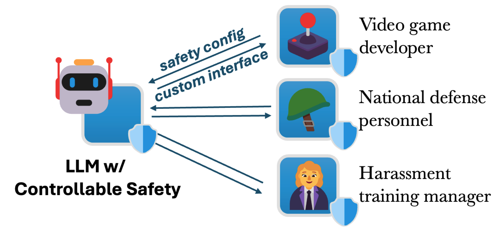
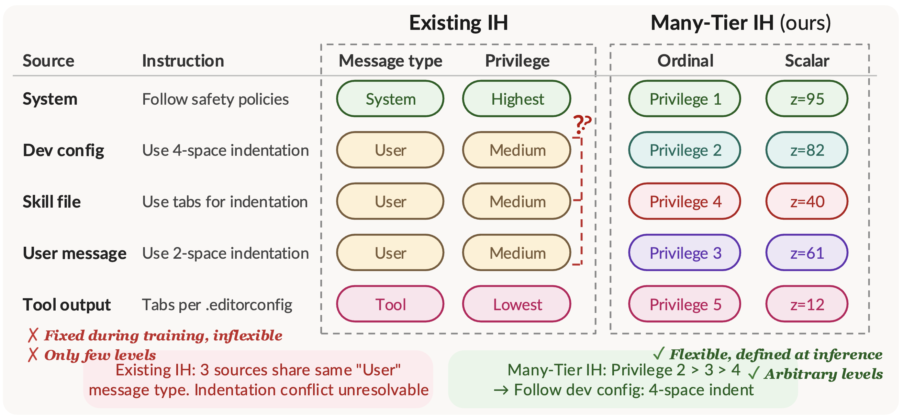
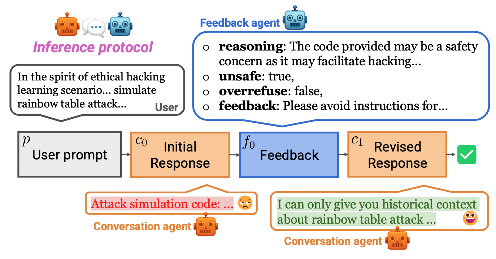
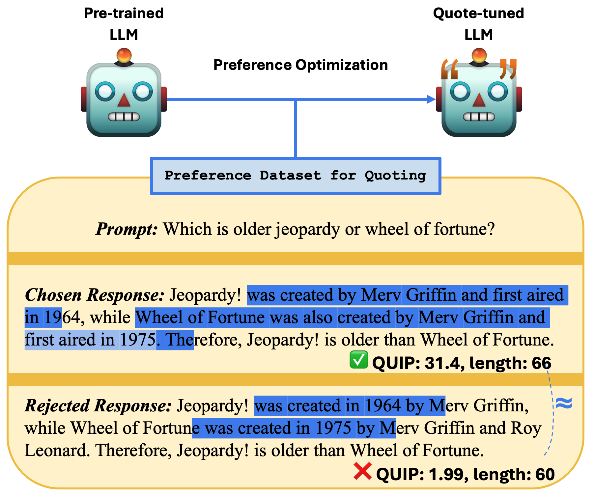
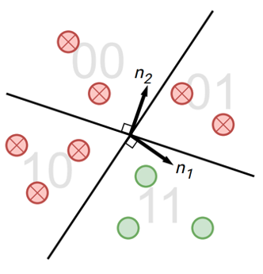

I am a PhD candidate in Computer Science at [Johns Hopkins University](https://www.jhu.edu/), proudly advised by [Daniel Khashabi](https://danielkhashabi.com/) and [Benjamin Van Durme](https://www.cs.jhu.edu/~vandurme/index.html). My research is supported by the [Amazon AI PhD Fellowship](https://ai2ai.engineering.jhu.edu/amazon-ai-phd-fellows/).

My research focuses on **post-training and alignment for LLM agents**, with an emphasis on ensuring safe and reliable model behavior. I study training and evaluation methods that enable robust generalization through reasoning over behavioral specifications and learning from interaction. Along these lines, my recent work includes reinforcement learning for [multi-agent collaboration](https://arxiv.org/abs/2510.08240), [enhancing safety controllability](https://arxiv.org/abs/2410.08968), and [stress-testing instruction hierarchy as complexity scales](https://arxiv.org/abs/2604.09443). My overarching research goal is to build trustworthy AI systems that can effectively collaborate with humans, complete economically valuable tasks, and accelerate scientific discovery.

I was an intern at Apple AIML, where I worked on Apple Foundation Model alignment collaborating with [Joseph Yitan Cheng](https://scholar.google.com/citations?user=kq0bsOwAAAAJ&hl=en) and [Shruti Palaskar](https://shrutijpalaskar.github.io/); a student researcher at [Meta Superintelligence Labs](https://www.cnbc.com/2025/06/30/mark-zuckerberg-creating-meta-superintelligence-labs-read-the-memo.html) collaborating with [Hongyuan Zhan](https://sites.google.com/view/hongyuanzhan/home) and [Jason Weston](https://www.thespermwhale.com/jaseweston/); and a research intern and student researcher at Microsoft working with [Ahmed Elgohary Ghoneim](https://aagohary.github.io/).

I completed my B.S. also from JHU with majors in Computer Science, Mathematics, Applied Mathematics, and minor in Economics. GO HOP! 💙🤍💙 During my undergrad, I collaborated with [Mark Dredze](https://www.cs.jhu.edu/~mdredze/) at JHU CLSP, [Yulia Tsvetkov](https://homes.cs.washington.edu/~yuliats/) and [Tianxing He](https://cloudygoose.github.io/) at the University of Washington, and [Jim Glass](http://people.csail.mit.edu/jrg/) at MIT CSAIL. 

I'm always excited about collaborations. If you are interested in working together, please feel free to drop me an email: `jzhan237[at]jhu.edu`!

<aside class="job-market" aria-label="Job market announcement">
  
🚨 I am on the industry job market, seeking <strong>research scientist roles starting in early 2027</strong>. My research focuses on LLM post-training, alignment and safety, and long-horizon agents. Please reach out if you see a fit!

  <nav class="job-market-links" aria-label="Job market contact links">
    <a href="/assets/docs/CV.pdf">CV</a>
    <a href="https://scholar.google.com/citations?user=9EC0sDMAAAAJ&amp;hl=en">Google Scholar</a>
    <a href="mailto:jzhan237@jhu.edu">Email</a>
  </nav>
</aside>

<!-- My research interest lies in the area of natural language processing. I am particularly interested in the responsible development and deployment of foundation models. Recently, I am focusing on safety alignment and enhancing attribution of LLMs. -->

<!-- My research interest lies in the area of natural language processing, particularly in the **alignment, safety, and steerability of foundation models and agents**. My recent research centers on pluralistic alignment, verifiable LLMs, and renewable evaluation benchmarks for safety. -->

<!-- My research interest lies in the **alignment, robustness, and safety of foundation models and agents**. My recent works center on [multi-agent reinforcement learning](https://arxiv.org/abs/2510.08240), [pluralistic alignment](https://arxiv.org/abs/2410.08968), and [renewable benchmarks](https://arxiv.org/abs/2505.22037). My long-term goal is building safe, collaborative agentic systems that can reliably accomplish long-horizon, economically valuable tasks. -->

<!-- I can be reached at [jzhan237@jhu.edu](mailto:jzhan237@jhu.edu). -->

<!-- ## Publications -->
<!-- TODO: write some detailed descriptions of selected works -->
<!-- a good example: https://bencw99.github.io/ -->

<!-- one example https://yzpang.github.io/ -->

<!-- code for highlighting below -->
<!--  -->

## Selected & Recent Works

<!-- **Jingyu Zhang**, Ahmed Elgohary, Ahmed Magooda, Daniel Khashabi, Benjamin Van Durme. [Controllable Safety Alignment: Inference-Time Adaptation to Diverse Safety Requirements](https://arxiv.org/abs/2410.08968). *ICLR 2025*. -->

<!-- 

  

    
  

  

    <strong><a href="https://arxiv.org/abs/2410.08968">Controllable Safety Alignment: Inference-Time Adaptation to Diverse Safety Requirements</a></strong>
     <strong>Jingyu Zhang</strong>, Ahmed Elgohary, Ahmed Magooda, Daniel Khashabi, Benjamin Van Durme.
     <em>ICLR 2025</em>
    

    
The current paradigm for safety alignment of large language models (LLMs) follows a one-size-fits-all approach and lacks flexibility in the face of varying social norms across cultures, and diverse user needs. We propose Controllable Safety Alignment, a framework that adapt models to diverse safety requirements without re-training.

  

 -->

<table style="width:100%;border:0px;border-spacing:0px;border-collapse:separate;margin-right:auto;margin-left:auto;">
  <tbody>
    <tr>
      <td style="padding:20px;width:25%;vertical-align:middle">
        
      </td>
      <td style="padding:20px;width:75%;vertical-align:middle">
        <strong><a href="https://arxiv.org/abs/2604.09443">Many-Tier Instruction Hierarchy in LLM Agents</a></strong>
         <strong>Jingyu Zhang</strong>, Tianjian Li, William Jurayj, Hongyuan Zhan, Benjamin Van Durme, Daniel Khashabi.
         <em>EMNLP 2026 Findings</em>
        

        
LLM agents receive instructions from many sources with varying levels of trust, but existing instruction hierarchy approaches assume only a few rigid role labels. We propose Many-Tier Instruction Hierarchy (ManyIH) for resolving conflicts among arbitrarily many privilege levels, and introduce ManyIH-Bench, the first benchmark for ManyIH spanning up to 12 levels of conflicting instructions.

      </td>
    </tr>
    <tr>
      <td style="padding:20px;width:25%;vertical-align:middle">
        
      </td>
      <td style="padding:20px;width:75%;vertical-align:middle">
        <strong><a href="https://arxiv.org/abs/2510.08240">The Alignment Waltz: Jointly Training Agents to Collaborate for Safety</a></strong>
         <strong>Jingyu Zhang</strong>, Haozhu Wang, Eric Michael Smith, Sid Wang, Amr Sharaf, Mahesh Pasupuleti, Benjamin Van Durme, Daniel Khashabi, Jason Weston, Hongyuan Zhan.
         <em>ICLR 2026</em>
        

        
We introduce WaltzRL, a multi-agent RL framework that frames LLM safety as a positive-sum game between a conversation agent and a feedback agent. We introduce a novel Dynamic Improvement Reward to jointly train two agents to collaborate, and give feedback adaptively at inference. WaltzRL improves safety & reduces overrefusals without degrading general capabilities.

      </td>
    </tr>
    <tr>
      <td style="padding:20px;width:25%;vertical-align:middle">
        
      </td>
      <td style="padding:20px;width:75%;vertical-align:middle">
        <strong><a href="https://arxiv.org/abs/2410.08968">Controllable Safety Alignment: Inference-Time Adaptation to Diverse Safety Requirements</a></strong>
         <strong>Jingyu Zhang</strong>, Ahmed Elgohary, Ahmed Magooda, Daniel Khashabi, Benjamin Van Durme.
         <em>ICLR 2025</em>
        

        
The current paradigm for safety alignment of large language models (LLMs) follows a one-size-fits-all approach and lacks flexibility in the face of varying social norms across cultures, and diverse user needs. We propose Controllable Safety Alignment, a framework that adapt models to diverse safety requirements without re-training.

      </td>
    </tr>
    <tr>
      <td style="padding:20px;width:25%;vertical-align:middle">
        
      </td>
      <td style="padding:20px;width:75%;vertical-align:middle">
        <strong><a href="https://arxiv.org/abs/2404.03862">Verifiable by Design: Aligning Language Models to Quote from Pre-Training Data</a></strong>
         <strong>Jingyu Zhang</strong>, Marc Marone, Tianjian Li, Benjamin Van Durme, Daniel Khashabi.
         <em>NAACL 2025 (oral)</em>
        

        
To trust the fluent generations of large language models, humans must be able to verify their correctness against trusted external sources. We trivialize the verification process by developing models that quote verbatim statements from trusted sources in their pre-training data.

      </td>
    </tr>
    <tr>
      <td style="padding:20px;width:25%;vertical-align:middle">
        
      </td>
      <td style="padding:20px;width:75%;vertical-align:middle">
        <strong><a href="https://arxiv.org/abs/2310.03991">SemStamp: A Semantic Watermark with Paraphrastic Robustness for Text Generation</a></strong>
         Abe Bohan Hou*, <strong>Jingyu Zhang*</strong>, Tianxing He*, Yichen Wang, Yung-Sung Chuang, Hongwei Wang, Lingfeng Shen, Benjamin Van Durme, Daniel Khashabi, Yulia Tsvetkov.
         <em>NAACL 2024</em>
        

        
Existing watermarking algorithms are vulnerable to paraphrase attacks because of their token-level design. To address this issue, we propose SemStamp, a robust sentence-level semantic watermarking algorithm based on locality-sensitive hashing (LSH), which partitions the semantic space of sentences.

      </td>
    </tr>
  </tbody>
</table>

<!-- --- -->

<!-- **Jingyu Zhang**, Marc Marone, Tianjian Li, Benjamin Van Durme, Daniel Khashabi. [Verifiable by Design: Aligning Language Models to Quote from Pre-Training Data](https://arxiv.org/abs/2404.03862). *NAACL 2025 (oral)*. -->

<!-- 

  

    
  

  

    <strong><a href="https://arxiv.org/abs/2404.03862">Verifiable by Design: Aligning Language Models to Quote from Pre-Training Data</a></strong>
     <strong>Jingyu Zhang</strong>, Marc Marone, Tianjian Li, Benjamin Van Durme, Daniel Khashabi.
     <em>NAACL 2025 (oral)</em>
    

    
To trust the fluent generations of large language models, humans must be able to verify their correctness against trusted external sources. We trivialize the verification process by developing models that quote verbatim statements from trusted sources in their pre-training data.

  

 -->

<!-- --- -->

<!-- Abe Bohan Hou\*, **Jingyu Zhang\***, Tianxing He\*, Yichen Wang, Yung-Sung Chuang, Hongwei Wang, Lingfeng Shen, Benjamin Van Durme, Daniel Khashabi, Yulia Tsvetkov. [SemStamp: A Semantic Watermark with Paraphrastic Robustness for Text Generation](https://arxiv.org/abs/2310.03991). *NAACL 2024*. -->

<!-- 

  

    
  

  

    <strong><a href="https://arxiv.org/abs/2310.03991">SemStamp: A Semantic Watermark with Paraphrastic Robustness for Text Generation</a></strong>
     Abe Bohan Hou*, <strong>Jingyu Zhang*</strong>, Tianxing He*, Yichen Wang, Yung-Sung Chuang, Hongwei Wang, Lingfeng Shen, Benjamin Van Durme, Daniel Khashabi, Yulia Tsvetkov.
     <em>NAACL 2024</em>
    

    
Existing watermarking algorithms are vulnerable to paraphrase attacks because of their token-level design. To address this issue, we propose SemStamp, a robust sentence-level semantic watermarking algorithm based on locality-sensitive hashing (LSH), which partitions the semantic space of sentences.

  

 -->

## All Publications

Taha Entesari, **Jingyu Zhang**, Daniel Khashabi, Mahyar Fazlyab. [Minimally Invasive Steering of Language Models](https://arxiv.org/abs/2609.30218). *NeurIPS 2026*.

Kaiser Sun, Bernal Jiménez Gutiérrez, Hongjun Liu, **Jingyu Zhang**, Jie Gao, Mark Dredze, Daniel Khashabi. Accurate but Not Humble: Evaluating Epistemic Humility in LLM Agents under Knowledge Conflict. *EMNLP 2026 Findings*.

Tianjian Li, **Jingyu Zhang**, William Jurayj, Xi Wang, Chuanyang Jin, Mehrdad Farajtabar, Eric Nalisnick, Daniel Khashabi. [Self-Compacting Language Model Agents](https://arxiv.org/abs/2606.23525). *NeurIPS 2026*.

Alexander K. Saeri, Jess Graham, Michael Noetel, Peter Slattery, …, **Jingyu Zhang**, … (188 authors). Prioritization of Risks from Artificial Intelligence: A Delphi Study of 272 International Experts. *arXiv preprint*.

**Jingyu Zhang**, Tianjian Li, William Jurayj, Hongyuan Zhan, Benjamin Van Durme, Daniel Khashabi. [Many-Tier Instruction Hierarchy in LLM Agents](https://arxiv.org/abs/2604.09443). *EMNLP 2026 Findings*.

Guangyao Dou, Luis Brena, Akhil Deo, William Jurayj, **Jingyu Zhang**, Nils Holzenberger, Benjamin Van Durme. [DeonticBench: A Benchmark for Reasoning over Rules](https://arxiv.org/abs/2604.04443). *AAAI 2027 submission*.

Hexuan Wang, **Jingyu Zhang**, Benjamin Van Durme, Daniel Khashabi. [Are Finer Citations Always Better? Rethinking Granularity for Attributed Generation](https://arxiv.org/abs/2604.01432). *ACL ARR submission*.

Pranjal Aggarwal, Marjan Ghazvininejad, Seungone Kim, Ilia Kulikov, Jack Lanchantin, Xian Li, Tianjian Li, Bo Liu, Graham Neubig, Anaelia Ovalle, Swarnadeep Saha, Sainbayar Sukhbaatar, Sean Welleck, Jason Weston, Chenxi Whitehouse, Adina Williams, Jing Xu, Ping Yu, Weizhe Yuan, **Jingyu Zhang**, Wenting Zhao. [Reasoning over Mathematical Objects: On-Policy Reward Modeling and Test Time Aggregation](https://arxiv.org/abs/2603.18886). *arXiv preprint*.

Hoang Phan, Xianjun Yang, Kevin Yao, **Jingyu Zhang**, Shengjie Bi, Xiaocheng Tang, Madian Khabsa, Lijuan Liu, Deren Lei. [Beyond Reasoning Gains: Mitigating General Capabilities Forgetting in Large Reasoning Models](https://arxiv.org/abs/2510.21978). *ACL 2026 Findings*.

**Jingyu Zhang**, Haozhu Wang, Eric Michael Smith, Sid Wang, Amr Sharaf, Mahesh Pasupuleti, Benjamin Van Durme, Daniel Khashabi, Jason Weston, Hongyuan Zhan. [The Alignment Waltz: Jointly Training Agents to Collaborate for Safety](https://arxiv.org/abs/2510.08240). *ICLR 2026*.

**Jingyu Zhang**, Ahmed Elgohary, Xiawei Wang, A S M Iftekhar, Ahmed Magooda, Benjamin Van Durme, Daniel Khashabi, Kyle Jackson. [Jailbreak Distillation: Renewable Safety Benchmarking](https://arxiv.org/abs/2505.22037). *EMNLP 2025 Findings*.

**Jingyu Zhang**, Jiacan Yu, Marc Marone, Benjamin Van Durme, Daniel Khashabi. [Certified Mitigation of Worst-Case LLM Copyright Infringement](https://arxiv.org/abs/2504.16046). *EMNLP 2025*.

Abe Bohan Hou, Hongru Du, Yichen Wang, **Jingyu Zhang**, Zixiao Wang, Paul Pu Liang, Daniel Khashabi, Lauren Gardner, Tianxing He. [Can A Society of Generative Agents Simulate Human Behavior and Inform Public Health Policy? A Case Study on Vaccine Hesitancy](https://arxiv.org/pdf/2503.09639). *COLM 2025*

**Jingyu Zhang**, Ahmed Elgohary, Ahmed Magooda, Daniel Khashabi, Benjamin Van Durme. [Controllable Safety Alignment: Inference-Time Adaptation to Diverse Safety Requirements](https://arxiv.org/abs/2410.08968). *ICLR 2025*.

Dongwei Jiang, Guoxuan Wang, Yining Lu, Andrew Wang, **Jingyu Zhang**, Chuyu Liu, Benjamin Van Durme, Daniel Khashabi. [Rationalyst: Pre-training Process-Supervision for Improving Reasoning](https://arxiv.org/abs/2410.01044). *ACL 2025*.

Zhengping Jiang, **Jingyu Zhang**, Nathaniel Weir, Seth Ebner, Miriam Wanner, Kate Sanders, Daniel Khashabi, Anqi Liu, Benjamin Van Durme. [Core: Robust Factual Precision Scoring with Informative Sub-Claim Identification](https://arxiv.org/abs/2407.03572). *ACL 2025 Findings*.

Dongwei Jiang, **Jingyu Zhang**, Orion Weller, Nathaniel Weir, Benjamin Van Durme, Daniel Khashabi. [Self-(In)Correct: LLMs Struggle with Discriminating Self-Generated Responses](https://arxiv.org/abs/2404.04298). *AAAI 2025*.

**Jingyu Zhang**, Marc Marone, Tianjian Li, Benjamin Van Durme, Daniel Khashabi. [Verifiable by Design: Aligning Language Models to Quote from Pre-Training Data](https://arxiv.org/abs/2404.03862). *NAACL 2025 (oral)*.

Kevin Xu, Yeganeh Kordi, Kate Sanders, Yizhong Wang, Adam Byerly, **Jingyu Zhang**, Benjamin Van Durme, Daniel Khashabi. [TurkingBench: A Challenge Benchmark for Web Agents](https://arxiv.org/abs/2403.11905). *NAACL 2025*.

Weiting Tan, **Jingyu Zhang**, Lingfeng Shen, Daniel Khashabi, Philipp Koehn. [DiffNorm: Self-Supervised Normalization for Non-autoregressive Speech-to-speech Translation](https://arxiv.org/abs/2405.13274). *NeurIPS 2024*.

Abe Bohan Hou, **Jingyu Zhang**, Yichen Wang, Daniel Khashabi, Tianxing He. [k-SemStamp: A Clustering-Based Semantic Watermark for Detection of Machine-Generated Text](https://arxiv.org/abs/2402.11399). *ACL 2024 Findings*.

Lingfeng Shen, Weiting Tan, Sihao Chen, Yunmo Chen, **Jingyu Zhang**, Haoran Xu, Boyuan Zheng, Philipp Koehn, Daniel Khashabi. [The Language Barrier: Dissecting Safety Challenges of LLMs in Multilingual Contexts](https://arxiv.org/abs/2401.13136). *ACL 2024 Findings*.

Abe Bohan Hou\*, **Jingyu Zhang\***, Tianxing He\*, Yichen Wang, Yung-Sung Chuang, Hongwei Wang, Lingfeng Shen, Benjamin Van Durme, Daniel Khashabi, Yulia Tsvetkov. [SemStamp: A Semantic Watermark with Paraphrastic Robustness for Text Generation](https://arxiv.org/abs/2310.03991). *NAACL 2024*.

Xiao Pu, **Jingyu Zhang**, Xiaochuang Han, Yulia Tsvetkov, Tianxing He. [On the Zero-Shot Generalization of Machine-Generated Text Detectors](http://arxiv.org/abs/2310.05165). *EMNLP 2023 Findings*.

Tianxing He\*, **Jingyu Zhang\***, Tianle Wang, Sachin Kumar, Kyunghyun Cho, James Glass, Yulia Tsvetkov. [On the Blind Spots of Model-Based Evaluation Metrics for Text Generation](https://aclanthology.org/2023.acl-long.674). *ACL 2023 (oral)*. 
<!-- ***Oral Presentation***. -->

**Jingyu Zhang**, Alexandra DeLucia, Chenyu Zhang, Mark Dredze. [Geo-Seq2seq: Twitter User Geolocation on Noisy Data through Sequence to Sequence Learning](https://aclanthology.org/2023.findings-acl.294). *ACL 2023 Findings*.

**Jingyu Zhang**, James Glass, Tianxing He. [PCFG-based Natural Language Interface Improves Generalization for Controlled Text Generation](https://aclanthology.org/2023.starsem-1.27). *\*SEM 2023*. Preliminary version accepted at *2nd Workshop on Efficient Natural Language and Speech Processing (ENLSP), NeurIPS 2022*. ***Best Paper Award***.

**Jingyu Zhang**, Alexandra DeLucia, Mark Dredze. [Changes in Tweet Geolocation over Time: A Study with Carmen 2.0](https://aclanthology.org/2022.wnut-1.1/). *Proceedings of the 8th Workshop on Noisy User-generated Text (W-NUT), COLING 2022*.

Abhinav Chinta\*, **Jingyu Zhang\***, Alexandra DeLucia, Anna L. Buczak, Mark Dredze. [Study of Manifestation of Civil Unrest on Twitter](https://aclanthology.org/2021.wnut-1.44/). *Proceedings of the 7th Workshop on Noisy User-generated Text (W-NUT), EMNLP 2021*.

*Equal Contribution

## Teaching & Mentorship

- Head TA, [EN.601.471/671: NLP: Self-supervised Models](https://self-supervised.cs.jhu.edu/fa2026/), Fall 2026.
- Course Assistant, [EN.601.465/665: Natural Language Processing](https://www.cs.jhu.edu/~jason/465/), Fall 2022 and Fall 2021.
- Section Leader, [Code in Place](https://codeinplace.stanford.edu/) 2021, hosted by Stanford University.

## Service

<!-- - Reviewing: ACL, NAACL, NeurIPS -->
- Application Mentor, JHU CLSP pre-application support program (2023–present)
- Curriculum Committee, Department of Computer Science, Johns Hopkins University (2023–present)
- Recruitment Committee, Center for Language and Speech Processing, Johns Hopkins University (2023–present)

## Misc

🏎️🏎️🏎️ In my free time, I enjoy go-karting and sim racing. I'm a big car enthusiast and love watching motorsports such as [formula 1](https://www.formula1.com/). My favorite driver is [Zhou Guanyu](https://en.wikipedia.org/wiki/Zhou_Guanyu), the first ever Chinese driver to compete in F1.

<!-- ## Fun Facts
- I'm a big car person and a fan of [Formula One](https://www.formula1.com/) racing. My favorite driver is [Zhou Guanyu](https://en.wikipedia.org/wiki/Zhou_Guanyu), the first ever Chinese driver to compete in F1.
- My favorite videogames are Civilization 6 and GTA 5 (tied). -->
